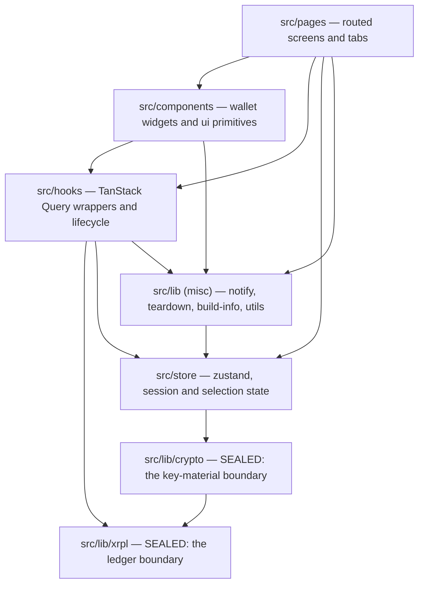

# Architecture Spine — XRPL Bench

`docs/decisions.md` §3 and §4 are binding and are not restated here. This spine
fixes only what those sections leave open: who owns what, which module may
depend on which, and what a new unit must go through rather than around.

Where this spine and the code disagree today, `GAP-REGISTER.md` says so with
file and line. A rule here is the target, not a description of the current tree.

## Design Paradigm

**Layered, with two sealed boundaries.**

Four layers, dependencies pointing one way only:

`pages` → `components` → `hooks` → `lib` + `store`

Layering alone is not enough here, because two modules under `lib` are different
in kind from the rest: one reaches the network, one holds key material. Both are
**sealed** — a single module owns the resource, and nothing outside it may
construct or touch that resource directly.

- **Ledger boundary:** `src/lib/xrpl/` owns every XRPL connection and every
  request.
- **Key-material boundary:** `src/lib/crypto/` owns every seed, every key, and
  every wrap/unwrap.



No arrow points upward. `src/components/ui` is a leaf: it may import
`@/lib/utils` and nothing else.

## Invariants & Rules

### AD-1 — Dependencies point one way

- **Binds:** all
- **Prevents:** a cycle, and a `lib` module that cannot be reasoned about or
  tested without dragging a React store or a component in with it.
- **Rule:** No module under `src/lib` may import from `src/hooks`,
  `src/components`, or `src/pages`. No module under `src/store` may import from
  `src/components` or `src/pages`. A `lib` module that needs to report something
  upward takes a callback or returns a value; it does not reach for a store.
- **One named exception:** `src/lib/notify.tsx` may import
  `src/store/notice-store`. That store is the funnel's sink, not shared
  application state, and the pairing is deliberate. It is the only `lib` → `store`
  edge permitted; any other is a violation.

### AD-2 — One owner of the ledger connection

- **Binds:** every ledger read and every write
- **Prevents:** a second connection pool, a read that skips the failover loop,
  and a call path that no test can intercept.
- **Rule:** Only modules under `src/lib/xrpl/` may import a `Client` from `xrpl`
  or call `getXrplClient`. Everything else goes through the exported read and
  write functions. Pure offline helpers from `xrpl` that touch no connection
  (`isValidClassicAddress` and its kind) are exempt and may be imported
  anywhere.

### AD-3 — One owner of key material

- **Binds:** seed generation, import, signing, reveal, unlock
- **Prevents:** a second place that turns a seed into a signer, which is a second
  place that has to get seed handling right.
- **Rule:** Only modules under `src/lib/crypto/` may call `Wallet.fromSeed` or
  otherwise turn a seed string into a signer. Screens ask
  `src/lib/crypto/keystore.ts` for what they need. A plaintext seed lives only
  in a local variable or a ref, never in React state, never in a store, never in
  a query cache.

### AD-4 — One factory owns every query key

- **Binds:** every TanStack Query read and every invalidation
- **Prevents:** an invalidation key drifting from the read key it is meant to
  match, which leaves stale data — in the worst case a previous wallet's balance
  — on screen after a switch or a send.
- **Rule:** Query keys are produced by a single exported factory. No other
  module constructs a key literal, for a read or for an invalidation. A read
  scoped to an account takes the active wallet and the active network; a read
  that is genuinely account-independent or device-scoped is a named function on
  the factory, so the exception is visible rather than implied.

### AD-5 — A non-extractable key handle is permitted session state `[ADOPTED]`

- **Binds:** unlock, session restore, auto-lock
- **Prevents:** an agent reading §4's "no secret in anything serializable"
  literally and removing working code, or the opposite — someone later putting
  actual seed bytes where the handle sits.
- **Rule:** A `CryptoKey` imported non-extractable may be held in session state
  and in the IndexedDB session store. Raw key bytes and plaintext seeds may not.
  The session entry carries an expiry and is deleted on every lock path. The
  exposure window is the auto-lock setting and is accepted as such.
  `docs/decisions.md` §4 owes one sentence saying this; see `GAP-REGISTER.md`.

### AD-6 — One source of truth for active wallet and active network

- **Binds:** every read, every write, every screen
- **Prevents:** two components disagreeing about which wallet is active, and
  stale cross-wallet or cross-network data surviving a switch.
- **Rule:** `src/store/app-store.ts` holds `network` and `activeWalletId` and
  nothing duplicates them into component state. Both reach a query through the
  factory in AD-4.

### AD-7 — Money arithmetic lives in one module

- **Binds:** balances, spendable, fees, send validation, trust-line reserve cost
- **Prevents:** the same drops calculation written twice and diverging, and a
  future edit reaching for a float because the surrounding code already does
  arithmetic inline.
- **Rule:** All arithmetic on drops or issued-currency values happens in
  `src/lib/xrpl/money.ts` and is called from elsewhere. Comparison and formatting
  too. No `Number()`, `parseFloat`, or `toFixed` touches a monetary value
  anywhere, including inside that module.

### AD-8 — Two declared error surfaces, chosen by cause `[MY CALL — override me]`

- **Binds:** every failure the user can see
- **Prevents:** the same class of failure appearing in the notice band in one
  screen and inline in another, because the rule was never written down.
- **Rule:** A failed **read** of data that has a place on screen renders inline,
  where the missing data would have been. Anything the user **did** — a send, a
  trust-line change, an unlock, an update — reports through `src/lib/notify.tsx`
  to the Annunciator. Errors and warnings there never auto-dismiss. Dismissal is
  part of the `notify` surface; nothing reaches into the notice store directly.

### AD-9 — Every write passes one choke point `[ADOPTED]`

- **Binds:** payments, trust-line changes
- **Prevents:** a write that forgets to raise `txInFlight`, which would let an
  app update activate mid-transaction.
- **Rule:** Every transaction submission goes through `submitAndClassify` in
  `src/lib/xrpl/writes.ts`. That function owns the in-flight flag and the result
  classification. How it reaches the flag is governed by AD-1, not here.

### AD-10 — Explorer links only through the shared components

- **Binds:** every address and every transaction hash shown anywhere
- **Prevents:** a link built by hand that points at the wrong network's explorer.
- **Rule:** Addresses and hashes render through `AddressLink` / `TxLink`. Using
  the URL builder directly in a hand-written anchor is a violation even when the
  URL is correct.

### AD-11 — One service-worker registration path

- **Binds:** app startup, update flow
- **Prevents:** two registrations racing, and an update prompt that fires from a
  path the update logic does not own.
- **Rule:** `src/lib/sw-register.ts` is the only module that imports the
  `virtual:pwa-register` specifier. Everything, including the app entry point,
  goes through it.

### AD-12 — The network boundary has a test seam

- **Binds:** `src/lib/xrpl/client.ts`, and any future module that owns an
  external resource
- **Prevents:** a failover path that can only be verified by unplugging a cable,
  which in practice means it is never verified.
- **Rule:** A module that owns an external resource exposes a way to substitute
  that resource in a test, and exposes a reset. Connection reuse, the timeout,
  and the fall-through to the backup endpoint are all reachable without a live
  network.

## Consistency Conventions

| Concern | Convention |
| --- | --- |
| Files and directories | kebab-case for modules (`query-reads.ts`), PascalCase for components (`AddressLink.tsx`). Tests in a sibling `__tests__/`. |
| Hooks | `use` + the thing read (`useTrustLines`), one query per hook, no side effects beyond the query. |
| Money in transit | Drops as decimal strings or `BigInt`. Never a `number`. Conversion to display happens only in `money.ts`. |
| Query keys | Built by the AD-4 factory. Account-scoped keys carry wallet and network; exceptions are named functions on the factory. |
| Errors crossing a boundary | A `lib` function throws or returns a typed result. It never notifies, never logs a secret, and never touches a store. |
| Result codes | Classified in `src/lib/xrpl/result-codes.ts`. A raw `tec`/`tef` string never reaches a screen unclassified. |
| Irreversible actions | A confirm step naming the exact consequence, per `docs/decisions.md` §4. No exceptions for "obvious" cases. |
| Unavailable controls | `aria-disabled` with the reason in visible text. Never hidden. |
| New unlock methods | Wrap the existing master key and unwrap on every attempt. Never derive-and-trust. |

## Stack

Read from `package.json` on 2026-09-12. Ranges are as declared there.

| Name | Version |
| --- | --- |
| bun | 1.3.1 |
| node | >=22 |
| typescript | ~6.0.2 |
| react / react-dom | ^19.2.8 |
| vite | ^8.2.2 |
| vite-plugin-pwa | ^1.3.0 |
| tailwindcss | ^4.3.3 |
| @tanstack/react-query | ^5.102.8 |
| zustand | ^5.0.15 |
| xrpl | ^5.1.0 |
| idb / idb-keyval | ^8.0.3 / ^6.3.0 |
| vitest | ^4.1.11 |
| oxlint | ^1.79.0 |

Radix primitives, `lucide-react`, `qrcode`, `class-variance-authority`,
`clsx`, `tailwind-merge` are present and unpinned beyond their ranges; none of
them carry an invariant.

## Structural Seed

```text
src/
  pages/        # routed screens: Onboarding, Unlock, Main + tabs/
  components/
    ui/         # shadcn primitives — leaf layer, imports @/lib/utils only
    wallet/     # domain widgets: AddressLink, TxLink, AmountInput, SeedReveal
  hooks/        # one query or one lifecycle concern each
  store/        # app-store (selection + session), notice-store
  lib/
    xrpl/       # SEALED — client, reads, writes, money, networks, result-codes
    crypto/     # SEALED — auth (wrap/unwrap), keystore, db, aes, webauthn, pin
    notify.tsx  # the only path to the Annunciator
    teardown.ts # the one place that clears caches, session and vault
```

Deployment: static assets built by Vite and served from a CDN pull zone per
environment. Three branches, `dev` → `stage` → `prod`, promoted on tree
equality. No server-side component exists in any environment; the ledger's
public RPC endpoints are the only backend the app talks to.

## Capability → Architecture Map

| Area | Lives in | Governed by |
| --- | --- | --- |
| Ledger reads (FR-29, FR-30, FR-35, FR-36) | `lib/xrpl/reads.ts` via `hooks/` | AD-2, AD-4, AD-6 |
| Payments and trust-line writes (FR-16..FR-25, FR-31..FR-33) | `lib/xrpl/writes.ts` | AD-2, AD-9, AD-7 |
| Unlock and key custody (FR-6..FR-12) | `lib/crypto/auth.ts`, `keystore.ts` | AD-3, AD-5 |
| Wallet and network selection (FR-13..FR-15, FR-38..FR-41) | `store/app-store.ts` | AD-6 |
| Notices (FR-53..FR-56) | `lib/notify.tsx`, `components/Annunciator.tsx` | AD-8 |
| Explorer cross-check (FR-42..FR-44) | `components/wallet/AddressLink.tsx`, `TxLink.tsx` | AD-10 |
| Versioning and updates (FR-46..FR-52) | `lib/sw-register.ts`, `hooks/useAppUpdate.ts` | AD-11, AD-9 |
| Money formatting and arithmetic (NFR-1) | `lib/xrpl/money.ts` | AD-7 |

## Deferred

- **Deferred XRPL features** — Checks, Escrow, Payment Channels, multi-signing
  and regular-key rotation. Each is its own epic and each will need its own
  boundary decision when it arrives; none changes the paradigm.
- **A second network provider or a user-editable endpoint.** AD-2 already seals
  the boundary this would sit behind, so the decision can wait until the feature
  is real.
- **Component-level test strategy.** AD-12 fixes the seam for external
  resources. Whether screens get tests, and of what kind, is not decided here —
  the current suite tests pure functions and two components, and that is a
  coverage question rather than a consistency one.
- **Internationalisation and RTL.** No module owns text direction today. Naming
  the owner is premature until RTL is actually reviewed.
- **Offline write queueing.** The app is deliberately network-first for ledger
  traffic and refuses to render a balance it cannot verify. Queuing a write
  offline would be a new state machine; not needed and not designed.
