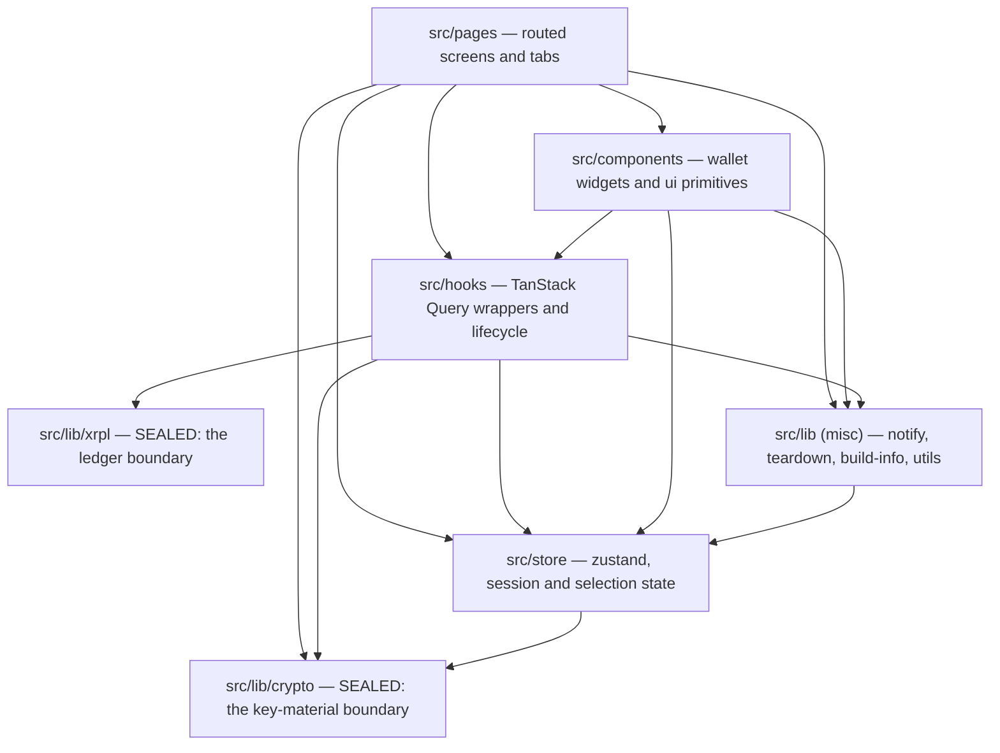

# Architecture Spine — XRPL Bench

`docs/decisions.md` §3 and §4 are binding and are not restated here. This spine
fixes only what those sections leave open: who owns what, which module may
depend on which, and what a new unit must go through rather than around.

Where this spine and the code disagree today, `GAP-REGISTER.md` says so with
file and line. A rule here is the target, not a description of the current tree.

An `AD` marked **`[GATED]`** is enforced mechanically by a script inside
`bun run lint`; it fails a merge. Every other `AD` is enforced by review only.

## Design Paradigm

**Layered, with two sealed boundaries.**

Four layers, dependencies pointing one way only:

`pages` → `components` → `hooks` → `lib` + `store`

Layering alone is not enough here, because two modules under `lib` are different
in kind from the rest: one reaches the network, one holds key material. Both are
**sealed** — a single module owns the resource, and nothing outside it may
construct or touch that resource directly.

- **Ledger boundary:** `src/lib/xrpl/` owns every XRPL connection and every
  request.
- **Key-material boundary:** `src/lib/crypto/` owns every seed, every key, and
  every wrap/unwrap.



No arrow points upward. `src/components/ui` is a leaf: it may import
`@/lib/utils`, `@/lib/notice-tone`, and its own siblings — nothing else. The
`notice-tone` edge is deliberate and is what lets `lib` and `store` name a tone
without importing a component (AD-8).

## Invariants & Rules

### AD-1 — Dependencies point one way `[GATED]`

- **Binds:** all
- **Prevents:** a cycle, and a `lib` module that cannot be reasoned about or
  tested without dragging a React store or a component in with it.
- **Rule:** No module under `src/lib` may import from `src/hooks`,
  `src/components`, or `src/pages`. No module under `src/store` may import from
  `src/components` or `src/pages`. A `lib` module that needs to report something
  upward takes a callback or returns a value; it does not reach for a store.
- **One named exception:** `src/lib/notify.tsx` may import
  `src/store/notice-store`. That store is the funnel's sink, not shared
  application state, and the pairing is deliberate. It is the only `lib` → `store`
  edge permitted; any other is a violation.

### AD-2 — One owner of the ledger connection

- **Binds:** every ledger read and every write
- **Prevents:** a second connection pool, a read that skips the failover loop,
  and a call path that no test can intercept.
- **Rule:** Only modules under `src/lib/xrpl/` may import a `Client` from `xrpl`
  or call `getXrplClient`. Everything else goes through the exported read and
  write functions. Pure offline helpers from `xrpl` that touch no connection
  (`isValidClassicAddress` and its kind) are exempt and may be imported
  anywhere.
- **Egress beyond the ledger is declared, not incidental.** AD-2 seals the
  `Client`, not the network. Every other outbound request — today the Testnet
  Faucet (`lib/xrpl/faucet.ts`) and the same-origin Release Manifest
  (`lib/release-check.ts`) — lives in a named `lib` module whose purpose is that
  call. A `fetch` from a hook, a component or a screen is a violation. The
  privacy claim in `PRODUCT.md` is a claim about this list, so the list has to be
  enumerable — **and closed**. Visible is not the same as permitted: adding a
  destination is a product decision, not an implementation one, and a module that
  merely follows the naming rule has not earned a new outbound host.
- **One named exception:** `src/hooks/useAccountLiveUpdates.ts` calls
  `getXrplClient` from outside `src/lib/xrpl/` and attaches a `transaction`
  listener to the returned client. It is a **push stream, not a read**: it
  issues `subscribe`/`unsubscribe` and invalidates the AD-4 query keys when a
  transaction affecting the active account validates — it fetches nothing and
  returns nothing. Wrapping it in a `lib/xrpl` read function would mean
  modelling a long-lived listener and a React unmount inside the read layer,
  for no gain: it still opens no second connection, because it goes through
  the one owner. It remains the only permitted caller of `getXrplClient`
  outside the boundary; any other is a violation.

### AD-3 — One owner of key material

- **Binds:** seed generation, import, signing, reveal, unlock
- **Prevents:** a second place that turns a seed into a signer, which is a second
  place that has to get seed handling right.
- **Rule:** Only modules under `src/lib/crypto/` may call `Wallet.fromSeed` or
  otherwise turn a seed string into a signer. Screens ask
  `src/lib/crypto/keystore.ts` for what they need. A plaintext seed lives only
  in a local variable or a ref, never in React state, never in a store, never in
  a query cache.

### AD-4 — One factory owns every query key `[GATED]`

- **Binds:** every TanStack Query read and every invalidation
- **Prevents:** an invalidation key drifting from the read key it is meant to
  match, which leaves stale data — in the worst case a previous wallet's balance
  — on screen after a switch or a send.
- **Rule:** Query keys are produced by a single exported factory. No other
  module constructs a key literal, for a read or for an invalidation. A read
  scoped to an account takes the active wallet and the active network; a read
  that is genuinely account-independent or device-scoped is a named function on
  the factory, so the exception is visible rather than implied.

### AD-5 — A non-extractable key handle is permitted session state `[ADOPTED]`

- **Binds:** unlock, session restore, auto-lock
- **Prevents:** an agent reading §4's "no secret in anything serializable"
  literally and removing working code, or the opposite — someone later putting
  actual seed bytes where the handle sits.
- **Rule:** A `CryptoKey` imported non-extractable may be held in session state
  and in the IndexedDB session store. Raw key bytes, plaintext seeds, and any
  **extractable** key may not — non-extractability is the whole basis of the
  permission. The window is *auto-lock minutes of inactivity*, extended by
  activity and ended by any lock path; expiry is **lazy**, so an entry past its
  time survives until the next session read or lock rather than disappearing on
  a timer. That is a longer window than "the auto-lock setting" suggests, and it
  is accepted as such. `docs/decisions.md` §4 states this in full.

### AD-6 — One source of truth for selection state and persisted entities

- **Binds:** every read, every write, every screen
- **Prevents:** two components disagreeing about which wallet is active, stale
  cross-wallet or cross-network data surviving a switch, and two features
  disagreeing about what makes two persisted records the same thing.
- **Rule:** `src/store/app-store.ts` holds `network` and `activeWalletId` and
  nothing duplicates them into component state. Both reach a query through the
  factory in AD-4.
- **It also owns the Address Book, and an entry's identity is the (address,
  destination tag) pair** — not the address alone. One exchange address with two
  tags is two counterparties, and collapsing them onto the address loses the tag
  that makes a payment arrive. The identity is a named function beside the
  entity, never re-derived at a call site. This is a target: today's entry is
  `{ address, label }` and dedupes on address (see `GAP-REGISTER.md`).

### AD-7 — Money arithmetic lives in one module

- **Binds:** balances, spendable, fees, send validation, trust-line reserve cost
- **Prevents:** the same drops calculation written twice and diverging, and a
  future edit reaching for a float because the surrounding code already does
  arithmetic inline.
- **Rule:** All arithmetic on drops or issued-currency values happens in
  `src/lib/xrpl/money.ts` and is called from elsewhere. Comparison and formatting
  too. No `Number()`, `parseFloat`, or `toFixed` touches a monetary value
  anywhere, **including inside that module** — deliberately stricter than §4,
  which exempts the render-time formatter. The carve-out is how a float reaches
  a formatter; formatting drops is string work and needs no numeric type.
- **Gated in part.** `scripts/check-money.mjs` fails `lint` on BigInt
  construction in `src/hooks`, `src/pages` and `src/components`. The rest of
  this rule — `src/lib`, `src/store`, and the `Number()`/`parseFloat`/`toFixed`
  ban — is enforced by review only, which is why this AD is not marked
  `[GATED]`.

### AD-8 — Three declared surfaces, chosen by cause `[ADOPTED]`

- **Binds:** every failure and every event the user can see
- **Prevents:** the same class of failure appearing in the notice band in one
  screen and inline in another, because the rule was never written down.
- **Rule:** A failed **read** of data that has a place on screen renders inline
  through `src/components/wallet/QueryErrorState.tsx`, which is the only owner
  of that surface. Anything the user **did** — a send, a trust-line change, an
  unlock, an update — reports through `src/lib/notify.tsx` to the Annunciator.
  So does anything that **arrived on its own** — an incoming payment, an
  activation detected, a new release available — which is neither an error nor
  user-initiated and is the third category `in-app-notices.md` US-2 names.
  Errors and warnings there never auto-dismiss. Dismissal is part of the
  `notify` surface. Nothing outside `src/lib/notify.tsx` and
  `src/components/Annunciator.tsx` touches the notice store — the Annunciator is
  that surface's renderer and is the only component permitted to read it. The tone
  vocabulary lives in `src/lib/notice-tone.ts`, not in a UI component, so
  `lib` and `store` can name a tone without importing upward.

### AD-9 — Every write passes one choke point `[ADOPTED]`

- **Binds:** every transaction this app signs — payments and trust-line changes
  today, and every type added later
- **Prevents:** a write that forgets to raise `txInFlight`, which would let an
  app update activate mid-transaction.
- **Rule:** Every transaction submission goes through `submitAndClassify` in
  `src/lib/xrpl/writes.ts`. That function owns the in-flight signal and the
  result classification. How it reaches the signal is governed by AD-1, not here.
- **The signal counts, it does not toggle.** Two writes can overlap, and a
  boolean cleared by whichever finishes first would report "nothing in flight"
  while a transaction is still live — the exact failure this AD exists to
  prevent. The choke point holds a depth, and in-flight means depth above zero.
- **The choke point must be reachable and wide enough to obey.** A new
  transaction type cannot be required to pass through a function it cannot
  import or whose parameter type excludes it. Since Epic 7 (2026-10-04)
  `submitAndClassify` is exported and typed on `SubmittableTransaction`, and
  holds the depth (G-16, G-17 closed — see `GAP-REGISTER.md`).

### AD-10 — Explorer links only through the shared components `[GATED]`

- **Binds:** every address and every transaction hash shown anywhere
- **Prevents:** a link built by hand that points at the wrong network's explorer.
- **Rule:** Addresses and hashes render through `AddressLink` / `TxLink`. Using
  the URL builder directly in a hand-written anchor is a violation even when the
  URL is correct.

### AD-11 — One service-worker registration path `[GATED]`

- **Binds:** app startup, update flow
- **Prevents:** two registrations racing, and an update prompt that fires from a
  path the update logic does not own.
- **Rule:** `src/lib/sw-register.ts` is the only module that imports the
  `virtual:pwa-register` specifier. Everything, including the app entry point,
  goes through it.

### AD-12 — The network boundary has a test seam

- **Binds:** `src/lib/xrpl/client.ts`, and any future module that owns an
  external resource
- **Prevents:** a failover path that can only be verified by unplugging a cable,
  which in practice means it is never verified.
- **Rule:** A module that owns an external resource exposes a way to substitute
  that resource in a test, and exposes a reset. Connection reuse, the timeout,
  and the fall-through to the backup endpoint are all reachable without a live
  network.

### AD-13 — A read-backed guard is satisfied only by a current read

- **Binds:** every guard on a money-moving action whose condition comes from a
  ledger read
- **Prevents:** a read that failed or went stale reading as permission. The
  shipped defect: `destInfo` was undefined, so `!destInfo?.requireDestTag` was
  satisfied, and a tagless payment was enabled to a destination that requires a
  tag — credited to nobody and unrecoverable.
- **Rule:** A guard fails **closed**. It is satisfied only by a read that
  succeeded for the input currently on screen; neither an errored read, nor data
  retained from an earlier input, nor a read outside its freshness window
  satisfies it. Absence of a prohibition is not permission.
- **Every transaction submission is a money-moving action.** There is no second
  category to argue about.
- **A guard lives inside the submit path, not only on the control.** The
  Conventions table requires an unavailable control to be `aria-disabled` with
  its reason visible — and `aria-disabled` does not prevent activation. A screen
  that only dims a button is literally compliant and factually unguarded.

### AD-14 — Retained data is never rendered as current

- **Binds:** every screen that renders query data
- **Prevents:** a figure from an earlier success surviving a failed refetch and
  reading as live — a stale balance under a green "Live" lamp, directly beneath
  "Balance unavailable".
- **Rule:** When a read is in error, data retained from an earlier success is
  not rendered: no figure, no liveness indicator, no derived total. AD-8's
  inline surface renders in its place.

### AD-15 — An empty state is a claim, not a default

- **Binds:** every screen that can render "nothing there"
- **Prevents:** reporting an unread ledger as an empty one. Two screens shipped
  this at once — history said "No transactions yet" and the tokens card said
  "No token balances yet", both on reads that had failed.
- **Rule:** A screen may state that a collection is empty only when its read
  **succeeded** and returned empty. A failed read renders the failure. A
  failure and an empty result are different facts and never share a rendering.

### AD-16 — One owner of local persistence teardown

- **Binds:** every module that persists anything, and every lock, removal and
  reset path
- **Prevents:** a "remove everything" that leaves data behind, and a lock that
  deletes something it was never meant to touch. Both have happened: the
  persisted app store survives a hard-lock reset, and the lock path deletes the
  precached shell.
- **Rule:** `src/lib/teardown.ts` owns the clear set, and it is **two** sets,
  never one. **Account data** — the vault, the query cache, live sockets, the
  persisted app store — never survives a teardown that claims to remove it.
  **The shell** — the service-worker precache — survives every lock, because it
  holds no account data to leak and the app must still open offline. A module
  that persists anything is incomplete until its clear is registered here; a new
  Cache Storage entry must declare which of the two sets it belongs to.

### AD-17 — Cache policy is architecture, and it fails safe toward staleness

- **Binds:** every deployed asset, the app shell, the service worker, and the
  Release Manifest
- **Prevents:** an edge-cached shell or manifest making a running instance
  unable to learn that a newer build exists — which would silently void the
  user-controlled update model, since a user cannot accept a version they are
  never told about. The provider's own default is the hazard: a fresh pull zone
  overrides `max-age` to thirty days on *everything*, `index.html` and `sw.js`
  included.
- **Rule:** The shell, the service worker, the web manifest and the Release
  Manifest are never edge-cached. The zone floor is short **zone-wide** rather
  than long with per-path exceptions, deliberately: if a rule ever fails to
  match, the failure must be "revalidates more often than necessary", a
  bandwidth cost, and never "serves a stale wallet", a correctness cost. Hashed
  assets are content-addressed and could be cached indefinitely; they are not,
  because no working per-path lever exists in the provider's API today — that is
  a known cost, not an oversight.
- **Enforcement:** `scripts/verify-headers.mjs` checks the shell property on
  every deploy. It is not part of `lint`, so this AD is deploy-gated rather than
  merge-gated. `infra/pullzone-cache.json` holds the settings and the reasoning;
  `docs/decisions.md` §8.7 is authoritative.

## Consistency Conventions

| Concern | Convention |
| --- | --- |
| Files and directories | kebab-case for modules (`query-reads.ts`), PascalCase for components (`AddressLink.tsx`). Tests in a sibling `__tests__/`. |
| Hooks | `use` + the thing read (`useTrustLines`), one query per hook, no side effects beyond the query. |
| Money in transit | Drops as decimal strings or `BigInt`. Never a `number`. Conversion to display happens only in `money.ts`. |
| Query keys | Built by the AD-4 factory. Account-scoped keys carry wallet and network; exceptions are named functions on the factory. |
| Errors crossing a boundary | A `lib` function throws or returns a typed result. It never notifies, never logs a secret, and never touches a store. |
| Result codes | Classified in `src/lib/xrpl/result-codes.ts`. A raw `tec`/`tef` string never reaches a screen unclassified. |
| Irreversible actions | A confirm step naming the exact consequence, per `docs/decisions.md` §4. No exceptions for "obvious" cases. |
| Unavailable controls | `aria-disabled` with the reason in visible text. Never hidden. |
| List identity | Row keys come from the item, never an array index — per-row state must not re-bind to a different item after a wallet switch (AD-6, PRD NFR-11). |
| Imperative one-shot reads | A pre-flight probe inside a submit handler uses `queryClient.fetchQuery` with the AD-4 factory key of the equivalent hook, so the probe and the displayed value cannot disagree. |
| New colour token | Its pairs are added to `scripts/check-contrast.mjs` in the same change. A token the harness does not measure is a token outside the rule. |
| Pinning a rendering rule | An `AD` that governs what a screen may show gets a screen-level test that fails when the rule is removed — not a test that merely passes today. |
| New unlock methods | Wrap the existing master key and unwrap on every attempt. Never derive-and-trust. |

## Stack

Re-read from `package.json` on 2026-09-15; unchanged since 2026-09-12. Ranges
are as declared there.

| Name | Version |
| --- | --- |
| bun | 1.3.1 |
| node | >=22 |
| typescript | ~6.0.2 |
| react / react-dom | ^19.2.8 |
| vite | ^8.2.2 |
| vite-plugin-pwa | ^1.3.0 |
| tailwindcss | ^4.3.3 |
| @tanstack/react-query | ^5.102.8 |
| zustand | ^5.0.15 |
| xrpl | ^5.1.0 |
| idb / idb-keyval | ^8.0.3 / ^6.3.0 |
| vitest | ^4.1.11 |
| oxlint | ^1.79.0 |
| @tailwindcss/vite | ^4.3.3 — must track `tailwindcss` exactly; a drift breaks the build |
| @vitejs/plugin-react | ^6.1.0 |

Radix primitives, `lucide-react`, `qrcode`, `class-variance-authority`,
`clsx`, `tailwind-merge` are present and unpinned beyond their ranges; none of
them carry an invariant.

## Structural Seed

```text
src/
  pages/        # routed screens: Onboarding, Unlock, Main + tabs/
  components/
    ui/         # shadcn primitives — leaf layer: @/lib/utils, @/lib/notice-tone,
                #   and siblings only
    wallet/     # domain widgets: AddressLink, TxLink, AmountInput, SeedReveal,
                #   QueryErrorState (the AD-8 inline failure surface)
  hooks/        # one query or one lifecycle concern each
  store/        # app-store (selection + session), notice-store
  lib/
    xrpl/       # SEALED — client, reads, writes, money, networks, result-codes
    crypto/     # SEALED — auth (wrap/unwrap), keystore, db, aes, webauthn, pin
    notify.tsx      # the only path to the Annunciator
    notice-tone.ts  # tone vocabulary, so lib/store never import a component
    teardown.ts     # the one place that clears caches, session and vault
```

Deployment: static assets built by Vite and served from a CDN pull zone per
environment. Three branches, `dev` → `stage` → `prod`, promoted on tree
equality. No server-side component exists in any environment. Outbound traffic
is the ledger's public RPC endpoints, plus two named exceptions under AD-2: the
Testnet Faucet, and the same-origin Release Manifest that makes user-controlled
updates possible.

## Capability → Architecture Map

| Area | Lives in | Governed by |
| --- | --- | --- |
| Ledger reads (FR-29, FR-30, FR-35, FR-36) | `lib/xrpl/reads.ts` via `hooks/` | AD-2, AD-4, AD-6 |
| Payments and trust-line writes (FR-16..FR-25, FR-31..FR-33) | `lib/xrpl/writes.ts` | AD-2, AD-9, AD-7 |
| Unlock and key custody (FR-6..FR-12) | `lib/crypto/auth.ts`, `keystore.ts` | AD-3, AD-5 |
| Wallet and network selection (FR-13..FR-15, FR-38..FR-41) | `store/app-store.ts` | AD-6 |
| Notices (FR-53..FR-56) | `lib/notify.tsx`, `components/Annunciator.tsx` | AD-8 |
| Explorer cross-check (FR-42..FR-44) | `components/wallet/AddressLink.tsx`, `TxLink.tsx` | AD-10 |
| Versioning and updates (FR-46..FR-52) | `lib/sw-register.ts`, `hooks/useAppUpdate.ts` | AD-11, AD-9 |
| Money formatting and arithmetic (NFR-1) | `lib/xrpl/money.ts` | AD-7 |
| Delivered-amount normalisation (FR-57) | `lib/xrpl/reads.ts` | AD-2 |
| Never setting `tfPartialPayment` (FR-58) | `lib/xrpl/writes.ts` | AD-2, AD-9 |
| Read-failure reporting | `components/wallet/QueryErrorState.tsx` | AD-8, AD-14, AD-15 |
| Local teardown on lock, removal and reset | `lib/teardown.ts` | AD-16 |
| Faucet and release-manifest egress | `lib/xrpl/faucet.ts`, `lib/release-check.ts` | AD-2 |

## Deferred

- **Deferred XRPL features** — Checks, Escrow, Payment Channels, multi-signing
  and regular-key rotation. Each is its own epic and each will need its own
  boundary decision when it arrives; none changes the paradigm.
- **A second network provider or a user-editable endpoint.** AD-2 already seals
  the boundary this would sit behind, so the decision can wait until the feature
  is real.
- **Component-level test strategy.** AD-12 fixes the seam for external
  resources. Breadth of screen coverage stays a coverage question, not a
  consistency one — but it is no longer unpatterned: four screen-level tests now
  pin the error paths of AD-13, AD-14 and AD-15, each written to fail if the
  rule is removed. See the Conventions table.
- **Internationalisation and RTL.** No module owns text direction today. Naming
  the owner is premature until RTL is actually reviewed.
- **The production origin.** The vault lives in IndexedDB, which is
  origin-scoped, so attaching a final hostname is not a later improvement — a
  move to a custom domain is a new origin with no vault, and every user re-imports
  from Seed while the old origin keeps serving a working, frozen wallet. It is a
  prerequisite of inviting anyone else, not a deployment detail.
  `docs/decisions.md` §8.11 is authoritative.
- **Offline write queueing.** The app is deliberately network-first for ledger
  traffic and refuses to render a balance it cannot verify. Queuing a write
  offline would be a new state machine; not needed and not designed.
